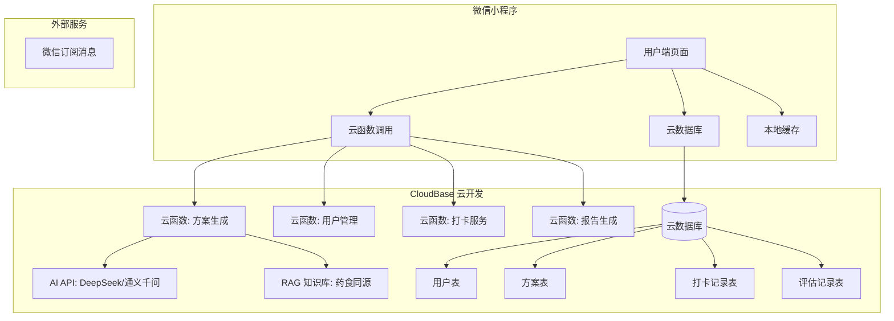

# 食寐有时 MVP 技术规格文档

> **Spec 版本**：v1.0
> **生成日期**：2026-07-27
> **基于**：产品方案 v1.0 + 用户操作路径业务流程图
> **目标平台**：微信小程序

---

## 1. 项目概述

### 1.1 项目信息

| 项目 | 说明 |
|------|------|
| 产品名称 | 食寐有时（Shi Mei You Shi） |
| 一句话定位 | 症状驱动的 AI 健康膳食食疗助手，围绕脑肠轴理论，用饮食调理改善失眠 |
| 目标用户 | 22-35 岁、一二线城市、高压行业白领，入睡困难/睡眠质量差 |
| MVP 目标 | 验证"症状驱动 → AI 食疗方案"的核心假设，3 个月注册用户 ≥ 5,000 |
| 技术栈 | 微信小程序 + 微信云开发 CloudBase + DeepSeek/通义千问 API + RAG |
| 开发方式 | AI 辅助开发（Cursor/Windsurf + 低代码平台） |

### 1.2 核心用户流程

```
进入食寐有时 → 微信授权登录 → 确认免责声明
→ 体质评估问卷(5-10题) → AI生成个性化助眠方案
→ 每日查看方案 → 打卡 + 睡眠评分(1-5)
→ 7天效果报告 → 方案自动微调 → 循环闭环
```

---

## 2. 技术架构

### 2.1 架构图



### 2.2 目录结构

```
miniprogram/
├── app.js                          # 小程序入口，云开发初始化
├── app.json                        # 全局配置（路由、窗口、tabBar）
├── app.wxss                        # 全局样式
├── pages/
│   ├── index/                      # 首页（Tab）
│   │   ├── index.js
│   │   ├── index.json
│   │   ├── index.wxml
│   │   └── index.wxss
│   ├── assessment/                 # 体质评估问卷页
│   │   ├── assessment.js
│   │   ├── assessment.json
│   │   ├── assessment.wxml
│   │   └── assessment.wxss
│   ├── plan/                       # 今日方案页
│   │   ├── plan.js
│   │   ├── plan.json
│   │   ├── plan.wxml
│   │   └── plan.wxss
│   ├── checkin/                    # 打卡评分页
│   │   ├── checkin.js
│   │   ├── checkin.json
│   │   ├── checkin.wxml
│   │   └── checkin.wxss
│   ├── report/                     # 效果报告页
│   │   ├── report.js
│   │   ├── report.json
│   │   ├── report.wxml
│   │   └── report.wxss
│   ├── disclaimer/                 # 免责声明页
│   │   ├── disclaimer.js
│   │   ├── disclaimer.json
│   │   ├── disclaimer.wxml
│   │   └── disclaimer.wxss
│   └── user/                       # 我的页面（Tab）
│       ├── user.js
│       ├── user.json
│       ├── user.wxml
│       └── user.wxss
├── components/
│   ├── meal-card/                   # 餐食卡片组件
│   ├── star-rating/                 # 星级评分组件
│   ├── progress-bar/                # 进度条组件
│   └── loading/                     # 加载态组件
├── cloudfunctions/
│   ├── login/                       # 登录云函数
│   ├── generatePlan/                # AI 方案生成云函数
│   ├── getFallbackPlan/             # 精选方案库兜底
│   ├── saveCheckin/                 # 保存打卡记录
│   ├── generateReport/              # 生成7天报告
│   ├── adjustPlan/                  # 方案微调
│   └── sendReminder/                # 推送提醒
├── utils/
│   ├── api.js                       # 云函数调用封装
│   ├── storage.js                   # 本地缓存工具
│   ├── validator.js                 # 校验工具
│   └── constants.js                 # 常量定义
├── config/
│   └── env.js                       # 环境配置
├── images/                          # 图片资源
└── styles/
    └── common.wxss                  # 公共样式
```

---

## 3. 功能模块规格

### 3.1 模块总览

| 模块编号 | 模块名称 | 对应页面 | 优先级 | 依赖 |
|---------|---------|---------|--------|------|
| M1 | 用户登录与授权 | index（入口） | P0 | 无 |
| M2 | 免责声明 | disclaimer | P0 | M1 |
| M3 | 体质评估问卷 | assessment | P0 | M2 |
| M4 | AI 方案生成 | plan（服务端） | P0 | M3 |
| M5 | 精选方案库兜底 | plan（服务端） | P1 | M3 |
| M6 | 每日方案查看 | plan | P0 | M4/M5 |
| M7 | 每日打卡+睡眠评分 | checkin | P0 | M6 |
| M8 | 7天效果报告 | report | P0 | M7 |
| M9 | 方案自动微调 | plan（服务端） | P0 | M8 |
| M10 | 推送提醒 | 服务端 | P1 | M7 |
| M11 | 异常处理（严重症状） | 全局 | P0 | M3 |

---

### 3.2 M1：用户登录与授权

**路由**：`pages/index/index`（首页入口）

**组件树**：
```
pages/index/index
├── <view> 品牌 Logo + 标语
├── <button open-type="getUserProfile"> 微信授权登录
└── <loading> 登录中...
```

**状态管理**：
| 状态 | 说明 |
|------|------|
| `isLoggedIn` | boolean，全局状态，存储在 app.globalData |
| `userInfo` | object，微信用户信息（昵称、头像） |
| `token` | string，登录凭证，存储在 wx.storage |

**交互流程**：

| 步骤 | 触发 | 前端行为 | 后端行为 | 异常处理 |
|------|------|---------|---------|---------|
| 1 | 用户进入小程序 | 检查本地 token 有效性 | — | — |
| 2 | 无有效 token | 显示登录按钮 | — | — |
| 3 | 点击"微信授权登录" | 调用 `wx.login()` 获取 code | — | 登录失败 → toast "登录失败，请重试" |
| 4 | — | 调用 `wx.getUserProfile()` 获取用户信息 | — | 用户拒绝授权 → 仍可进入（仅 code 登录） |
| 5 | — | 调用云函数 `login` 传入 code + userInfo | 换取 openid + 生成 token | 网络异常 → toast "网络不可用" |
| 6 | 登录成功 | 存储 token → 跳转免责声明页 | 创建/更新用户记录 | — |

**API 契约**：
```typescript
// 云函数: login
// 入参
interface LoginRequest {
  code: string;           // wx.login() 返回的 code
  userInfo?: {
    nickName: string;
    avatarUrl: string;
  };
}

// 出参
interface LoginResponse {
  success: boolean;
  token: string;
  user: {
    openid: string;
    nickName: string;
    avatarUrl: string;
    createdAt: Date;
  };
}
```

**边界条件**：
- [x] 用户拒绝授权 → 仅 code 登录，不获取头像昵称
- [x] `wx.login()` 调用失败 → 重试 3 次，仍失败则提示"网络不可用"
- [x] 云函数超时（5s） → 提示"服务繁忙，请稍后重试"
- [x] 已登录用户再次进入 → 跳过登录页，直接进入方案页

---

### 3.3 M2：免责声明

**路由**：`pages/disclaimer/disclaimer`

**组件树**：
```
pages/disclaimer/disclaimer
├── <view> 免责声明全文（滚动区域）
├── <checkbox> 我已阅读并同意
└── <button> 确认并继续
```

**状态管理**：
| 状态 | 说明 |
|------|------|
| `hasAgreed` | boolean，存储在云数据库 user 表 |
| `agreedAt` | timestamp，同意时间 |

**交互流程**：

| 步骤 | 触发 | 前端行为 | 后端行为 | 异常处理 |
|------|------|---------|---------|---------|
| 1 | 登录成功 | 跳转免责声明页 | — | — |
| 2 | 用户勾选同意 | 启用"确认并继续"按钮 | — | — |
| 3 | 点击"确认并继续" | 调用云函数更新同意状态 | 更新 user 表 `hasAgreed=true` | 网络异常 → "请检查网络" |
| 4 | 更新成功 | 跳转体质评估页 | — | — |

**边界条件**：
- [x] 未勾选同意 → 按钮置灰，不可点击
- [x] 用户拒绝同意 → 退出应用（`wx.navigateBack` 无法返回时显示提示）
- [x] 已同意过的用户 → 不重复展示免责声明页
- [x] 声明内容必须以醒目方式提示"饮食调理建议，不替代医疗诊断"

---

### 3.4 M3：体质评估问卷

**路由**：`pages/assessment/assessment`

**组件树**：
```
pages/assessment/assessment
├── <progress-bar> 答题进度
├── <view> 题目区域
│   ├── <text> 题目文本
│   └── <radio-group> 选项列表
└── <button> 下一题 / 提交
```

**数据模型**：
```typescript
// 问卷题目
interface AssessmentQuestion {
  id: string;              // 题目编号 Q1-Q10
  type: 'single' | 'multiple';
  text: string;
  options: {
    value: string;
    label: string;
    score: number;         // 选项分值（用于体质判定）
  }[];
}

// 用户答案
interface AssessmentAnswer {
  questionId: string;
  selectedValues: string[];
}

// 评估结果
interface AssessmentResult {
  constitution: string;    // 体质类型：qi_deficiency / yin_deficiency / yang_deficiency / phlegm_dampness / qi_stagnation / balanced
  constitutionLabel: string; // 体质中文名：气虚质/阴虚质/阳虚质/痰湿质/气郁质/平和质
  symptomScore: number;    // 失眠严重程度评分 0-100
  primarySymptoms: string[]; // 主要症状标签
  completedAt: Date;
}
```

**题目结构**（5-10 题）：

| 题号 | 题目 | 类型 | 选项示例 |
|------|------|------|---------|
| Q1 | 您通常需要多长时间才能入睡？ | single | <15分钟 / 15-30分钟 / 30-60分钟 / >60分钟 |
| Q2 | 您每晚的实际睡眠时长约为？ | single | >7小时 / 5-7小时 / 3-5小时 / <3小时 |
| Q3 | 您是否容易在夜间醒来？ | single | 从不 / 偶尔（1-2次/周） / 经常（3-4次/周） / 几乎每晚 |
| Q4 | 您是否感觉手脚冰凉？ | single | 从不 / 偶尔 / 经常 / 总是 |
| Q5 | 您是否容易口干舌燥？ | single | 从不 / 偶尔 / 经常 / 总是 |
| Q6 | 您是否感觉身体沉重、困倦？ | single | 从不 / 偶尔 / 经常 / 总是 |
| Q7 | 您是否容易情绪低落或烦躁？ | single | 从不 / 偶尔 / 经常 / 总是 |
| Q8 | 您的饮食习惯是？ | multiple | 三餐规律 / 常吃外卖 / 不吃早餐 / 夜宵频繁 / 饮食清淡 |
| Q9 | 您是否有以下消化问题？ | multiple | 胃胀 / 便秘 / 腹泻 / 嗳气 / 无 |
| Q10 | 您目前承受的压力程度？ | single | 几乎没有 / 轻微 / 中等 / 很大 |

**交互流程**：

| 步骤 | 触发 | 前端行为 | 后端行为 | 异常处理 |
|------|------|---------|---------|---------|
| 1 | 进入评估页 | 显示第 1 题 + 进度条 0% | — | — |
| 2 | 选择答案 | 高亮选中项，启用"下一题" | — | — |
| 3 | 点击"下一题" | 保存答案到本地，显示下一题，进度条 +10% | — | — |
| 4 | 最后一题 | 按钮变为"提交" | — | — |
| 5 | 点击"提交" | 显示 loading，调用云函数 | 计算体质类型 + 症状评分，生成评估结果，存储到云数据库 | 网络异常 → 本地缓存答案，下次进入时重试 |
| 6 | 评估完成 | 跳转方案页，触发方案生成 | — | — |

**边界条件**：
- [x] 未完成全部题目 → 不可提交
- [x] 中途退出 → 下次进入时从第 1 题重新开始（简化处理，不做断点续答）
- [x] 已评估过的用户 → 显示"重新评估"入口，但需提示"重新评估将生成新方案"
- [x] 评估结果中如检测到"严重失眠"（症状评分 > 80） → 弹窗提示"建议同时咨询医生"

---

### 3.5 M4：AI 个性化助眠方案生成

**触发**：完成体质评估后自动触发

**云函数**：`cloudfunctions/generatePlan/index.js`

**数据模型**：
```typescript
// 饮食方案
interface MealPlan {
  planId: string;
  userId: string;
  assessmentResult: AssessmentResult;
  generatedAt: Date;
  version: number;              // 方案版本号（首次为 1，微调后递增）
  meals: {
    breakfast: MealItem;        // 早餐
    lunch: MealItem;            // 午餐
    dinner: MealItem;           // 晚餐
    bedtime: MealItem;          // 睡前食疗
  };
  tips: string[];               // 饮食小贴士
  disclaimer: string;           // 免责声明文本
  aiModel: string;              // 使用的 AI 模型名称
  satisfaction?: number;        // 用户满意度评分（1-5）
}

interface MealItem {
  name: string;                 // 餐食名称
  ingredients: string[];        // 食材清单
  reason: string;               // 食疗原理（为什么选这个）
  instructions: string;         // 制作说明
  alternatives?: string[];      // 替代方案（如外卖可选）
}
```

**AI 方案生成流程**：

| 步骤 | 行为 | 说明 |
|------|------|------|
| 1 | 接收评估结果 | 体质类型 + 症状评分 + 主要症状 |
| 2 | 构建 Prompt | 基于评估结果 + RAG 知识库检索相关药食同源知识 |
| 3 | 调用 AI API | 发送至 DeepSeek/通义千问，生成三餐+睡前方案 |
| 4 | 解析 AI 响应 | 提取结构化 JSON，校验字段完整性 |
| 5 | 安全兜底 | 校验食材是否在食药物质目录内，不在则替换为兜底方案 |
| 6 | 存储方案 | 存入云数据库 `meal_plans` 集合 |
| 7 | 返回方案 | 前端展示 |

**Prompt 模板**（关键约束）：
```
你是一位持证公共营养师，请根据以下用户信息生成一份个性化助眠饮食方案：

用户体质：{constitutionLabel}
症状评分：{symptomScore}/100
主要症状：{primarySymptoms}

要求：
1. 生成早餐、午餐、晚餐、睡前食疗共4餐
2. 所有食材必须在以下药食同源目录内：{allowedIngredients}
3. 每餐包含：餐食名称、食材清单、食疗原理、制作说明
4. 方案必须标注"饮食调理建议，不替代医疗诊断"
5. 如果用户症状评分 > 80，额外提示"建议咨询医生"
6. 输出格式为 JSON

禁止：
- 推荐目录外的食材
- 使用"治疗""治愈"等医疗声称
- 推荐药物或保健品
```

**错误处理**：
| 错误场景 | 处理方式 |
|---------|---------|
| AI API 超时（10s） | 重试 1 次，仍失败 → 降级到精选方案库 |
| AI 返回格式无法解析 | 降级到精选方案库 |
| 方案中包含非目录食材 | 过滤 + 替换为兜底方案 |
| 方案生成成功但内容为空 | 降级到精选方案库 |

---

### 3.6 M5：精选方案库兜底

**触发**：AI 方案生成失败时自动触发

**云函数**：`cloudfunctions/getFallbackPlan/index.js`

**数据模型**：
```typescript
interface FallbackPlan {
  planId: string;
  constitution: string;         // 适配的体质类型
  meals: {
    breakfast: MealItem;
    lunch: MealItem;
    dinner: MealItem;
    bedtime: MealItem;
  };
  tips: string[];
  createdAt: Date;
}
```

**方案库内容**：每种体质至少预置 2 套方案，共 12-15 套静态模板。

**选择逻辑**：
1. 根据用户体质类型匹配方案库
2. 同体质有多套方案时，随机选择（避免重复）
3. 记录兜底方案使用次数，用于后续优化 AI 模型

---

### 3.7 M6：每日方案查看

**路由**：`pages/plan/plan`

**组件树**：
```
pages/plan/plan
├── <view> 日期切换
├── <view> 体质标签
├── <meal-card> 早餐
│   ├── <text> 餐食名称
│   ├── <text> 食材清单
│   ├── <text> 食疗原理
│   └── <text> 制作说明
├── <meal-card> 午餐
├── <meal-card> 晚餐
├── <meal-card> 睡前食疗
├── <view> 饮食小贴士
├── <text> 免责声明
└── <button> 去打卡
```

**状态管理**：
| 状态 | 说明 |
|------|------|
| `currentPlan` | MealPlan，当前方案数据 |
| `planHistory` | MealPlan[]，历史方案列表 |
| `isLoading` | boolean，加载态 |

**交互流程**：

| 步骤 | 触发 | 前端行为 | 异常处理 |
|------|------|---------|---------|
| 1 | 进入方案页 | 加载今日方案 | 网络异常 → 显示缓存方案 |
| 2 | 方案加载中 | 显示骨架屏 | — |
| 3 | 方案加载完成 | 渲染 4 餐食卡片 | 方案为空 → 触发重新生成 |
| 4 | 点击"去打卡" | 跳转打卡页 | — |
| 5 | 切换历史日期 | 加载对应日期方案 | 无方案 → "该日期暂无方案记录" |

**边界条件**：
- [x] 首次进入无方案 → 自动触发方案生成，显示 loading + 提示"正在为你生成专属方案"
- [x] 方案生成失败 → 显示错误提示 + "重试"按钮
- [x] 食材包含过敏原（未来扩展） → 本期不做，标注"待确认"

---

### 3.8 M7：每日打卡 + 睡眠评分

**路由**：`pages/checkin/checkin`

**组件树**：
```
pages/checkin/checkin
├── <view> 日期显示
├── <view> 餐食打卡区
│   ├── <checkbox-group> 早餐
│   ├── <checkbox-group> 午餐
│   ├── <checkbox-group> 晚餐
│   └── <checkbox-group> 睡前食疗
├── <view> 睡眠评分区
│   ├── <text> 昨晚睡得怎么样？
│   └── <star-rating> 1-5 星评分
├── <text> 可选备注
└── <button> 提交打卡
```

**数据模型**：
```typescript
interface CheckinRecord {
  recordId: string;
  userId: string;
  planId: string;
  date: string;                 // YYYY-MM-DD
  meals: {
    breakfast: boolean;         // 是否完成
    lunch: boolean;
    dinner: boolean;
    bedtime: boolean;
  };
  sleepScore: number;           // 1-5
  note?: string;                // 备注
  createdAt: Date;
}
```

**交互流程**：

| 步骤 | 触发 | 前端行为 | 后端行为 | 异常处理 |
|------|------|---------|---------|---------|
| 1 | 进入打卡页 | 加载今日方案餐食列表 | — | — |
| 2 | 勾选完成的餐食 | 更新本地状态 | — | — |
| 3 | 点击星星评分 | 高亮选中星星，显示对应文字（1-很差 → 5-很好） | — | — |
| 4 | 点击"提交打卡" | 校验：至少勾选 1 餐 + 评分 | 存储打卡记录到 `checkins` 集合 | 网络异常 → 本地缓存，下次进入时自动提交 |
| 5 | 提交成功 | toast "打卡成功"，跳转方案页 | — | — |

**边界条件**：
- [x] 未勾选任何餐食 → 不可提交，"请至少标记一项饮食完成情况"
- [x] 未评分 → 不可提交，"请给昨晚的睡眠评个分吧"
- [x] 当日已打卡 → 显示"今日已打卡"，可修改（覆盖旧记录）
- [x] 打卡后方案页显示"今日已完成"标记
- [x] 连续 3 天未打卡 → 触发推送提醒（M10）

---

### 3.9 M8：7 天效果报告

**路由**：`pages/report/report`

**组件树**：
```
pages/report/report
├── <view> 报告标题
├── <view> 数据概览卡片
│   ├── <text> 打卡天数 / 7
│   ├── <text> 平均睡眠评分
│   └── <text> 评分趋势
├── <view> 睡眠评分趋势图（折线图）
├── <view> 餐食完成率统计
├── <view> AI 改善建议
└── <button> 分享报告
```

**云函数**：`cloudfunctions/generateReport/index.js`

**数据模型**：
```typescript
interface WeeklyReport {
  reportId: string;
  userId: string;
  startDate: string;            // YYYY-MM-DD
  endDate: string;              // YYYY-MM-DD
  stats: {
    totalCheckins: number;      // 打卡天数
    avgSleepScore: number;      // 平均睡眠评分
    sleepScoreTrend: number[];  // 7天评分数组
    mealCompletion: {
      breakfast: number;        // 完成率
      lunch: number;
      dinner: number;
      bedtime: number;
    };
  };
  improvement: string;          // AI 生成的改善建议
  generatedAt: Date;
}
```

**生成条件**：
- 累计打卡天数 ≥ 7 天，自动触发报告生成
- 首次生成在第 7 天打卡后
- 之后每 7 天（14 天、21 天...）生成一次

**交互流程**：

| 步骤 | 触发 | 前端行为 | 后端行为 | 异常处理 |
|------|------|---------|---------|---------|
| 1 | 累积 7 天打卡 | 打卡提交后弹窗"已坚持 7 天，查看效果报告" | 云函数生成报告 | 生成失败 → 静默重试，用户可手动进入报告页 |
| 2 | 点击"查看报告" | 加载报告数据 | — | 加载失败 → "报告生成中，请稍后查看" |
| 3 | 报告加载完成 | 渲染数据卡片 + 趋势图 | — | — |
| 4 | 点击"分享报告" | 生成分享图片（canvas 绘制） | — | canvas 绘制失败 → "请截图分享" |

**边界条件**：
- [x] 打卡不足 7 天 → 报告页显示"已坚持 X 天，再坚持 Y 天即可查看报告"
- [x] 评分趋势下降 → 报告附带"建议咨询医生"提示
- [x] 评分趋势上升 → 报告附带正面鼓励 + 方案微调（M9）

---

### 3.10 M9：方案自动微调

**触发**：7 天报告生成后自动触发

**云函数**：`cloudfunctions/adjustPlan/index.js`

**微调逻辑**：
1. 读取最近 7 天的打卡记录和睡眠评分
2. 分析趋势：上升 / 平稳 / 下降
3. 结合用户反馈（备注）调整方案
4. 调用 AI API 生成新版本方案，方案 version 递增

**微调规则**：
| 评分趋势 | 调整策略 |
|---------|---------|
| 上升（连续 3 天评分 > 之前平均值） | 方案继续执行，微调口味（增加用户评分高的餐食） |
| 平稳（评分波动 < 0.5） | 增加 1-2 种新食材，增加变化 |
| 下降（连续 3 天评分 < 之前平均值） | 更换 50% 以上餐食，重新匹配体质方案 |

**边界条件**：
- [x] 评分数据不足（< 3 天） → 不触发微调
- [x] 微调生成失败 → 保留原方案，不降级
- [x] 用户可手动拒绝微调方案 → 保留原方案

---

### 3.11 M10：推送提醒

**云函数**：`cloudfunctions/sendReminder/index.js`

**触发方式**：定时触发器（微信云开发定时触发器，每天早上 8:00 和晚上 20:00）

**消息类型**：

| 消息类型 | 触发条件 | 模板内容 | 跳转页面 |
|---------|---------|---------|---------|
| 每日方案提醒 | 每天 8:00 | "早安！今日助眠方案已就绪，点击查看" | pages/plan/plan |
| 睡前打卡提醒 | 每天 20:00 | "今晚睡得怎么样？记得打卡记录哦" | pages/checkin/checkin |
| 连续未打卡提醒 | 连续 3 天未打卡 | "你已经 3 天没打卡了，坚持就是胜利！" | pages/checkin/checkin |
| 7 天报告提醒 | 累计 7 天打卡 | "恭喜坚持 7 天！你的睡眠改善报告已生成" | pages/report/report |

**实现方式**：
- 使用微信订阅消息（`wx.requestSubscribeMessage`）
- 在用户首次进入时请求订阅授权
- 云函数中调用 `cloud.openapi.subscribeMessage.send` 发送消息

**边界条件**：
- [x] 用户未订阅 → 不发送消息，不弹窗骚扰
- [x] 当日已打卡 → 跳过晚间提醒
- [x] 网络异常 → 静默失败，不重试

---

### 3.12 M11：异常处理（严重症状）

**触发**：评估问卷中检测到严重症状时

**交互流程**：

| 步骤 | 触发 | 前端行为 |
|------|------|---------|
| 1 | 评估结果症状评分 > 80 | 弹窗提示"您的睡眠问题较为严重，建议同时咨询专业医生" |
| 2 | 评估结果包含"心悸""胸痛""呼吸困难"等关键词 | 弹窗提示"您描述的症状需要专业医疗评估，建议立即就医" |
| 3 | 用户选择"我知道了" | 继续生成方案，方案中额外标注就医建议 |

**边界条件**：
- [x] 严重症状提示不阻止用户使用产品
- [x] 所有方案底部均标注"饮食调理建议，不替代医疗诊断"

---

## 4. 数据模型

### 4.1 云数据库集合

#### users（用户表）
```typescript
interface User {
  _id: string;
  openid: string;              // 微信 openid
  nickName: string;
  avatarUrl: string;
  hasAgreed: boolean;          // 是否同意免责声明
  agreedAt?: Date;
  constitution?: string;       // 体质类型
  currentPlanId?: string;      // 当前方案 ID
  subscribedTemplates: string[]; // 已订阅的消息模板 ID
  createdAt: Date;
  updatedAt: Date;
}
```

#### assessments（评估记录表）
```typescript
interface AssessmentRecord {
  _id: string;
  userId: string;
  answers: AssessmentAnswer[];
  result: AssessmentResult;
  createdAt: Date;
}
```

#### meal_plans（方案表）
```typescript
interface MealPlanRecord {
  _id: string;
  userId: string;
  assessmentId: string;
  version: number;
  meals: {
    breakfast: MealItem;
    lunch: MealItem;
    dinner: MealItem;
    bedtime: MealItem;
  };
  tips: string[];
  disclaimer: string;
  aiModel: string;
  isFallback: boolean;        // 是否兜底方案
  satisfaction?: number;
  createdAt: Date;
}
```

#### checkins（打卡记录表）
```typescript
interface CheckinRecord {
  _id: string;
  userId: string;
  planId: string;
  date: string;               // YYYY-MM-DD
  meals: {
    breakfast: boolean;
    lunch: boolean;
    dinner: boolean;
    bedtime: boolean;
  };
  sleepScore: number;
  note?: string;
  createdAt: Date;
}
```

#### reports（效果报告表）
```typescript
interface ReportRecord {
  _id: string;
  userId: string;
  startDate: string;
  endDate: string;
  stats: ReportStats;
  improvement: string;
  createdAt: Date;
}
```

### 4.2 校验规则

| 字段 | 规则 |
|------|------|
| `sleepScore` | 1-5 整数 |
| `date` | 格式 YYYY-MM-DD，不晚于当天 |
| `version` | 正整数，从 1 开始 |
| `constitution` | 枚举值：qi_deficiency / yin_deficiency / yang_deficiency / phlegm_dampness / qi_stagnation / balanced |

---

## 5. API 契约

### 5.1 云函数清单

| 云函数名 | 触发方式 | 入参 | 出参 |
|---------|---------|------|------|
| `login` | 前端调用 | `{ code, userInfo? }` | `{ success, token, user }` |
| `generatePlan` | 前端调用 | `{ assessmentId }` | `{ success, plan }` |
| `getFallbackPlan` | generatePlan 内部调用 | `{ constitution }` | `{ success, plan }` |
| `saveCheckin` | 前端调用 | `{ planId, meals, sleepScore, note? }` | `{ success, recordId }` |
| `generateReport` | 前端调用/触发器 | `{ userId }` | `{ success, report }` |
| `adjustPlan` | generateReport 内部调用 | `{ userId, currentPlanId, report }` | `{ success, newPlan }` |
| `sendReminder` | 定时触发器 | `{ type }` | `{ success, sentCount }` |

### 5.2 错误码定义

| 错误码 | 说明 |
|--------|------|
| 0 | 成功 |
| 1001 | 用户未登录 |
| 1002 | 未完成评估 |
| 1003 | 方案生成失败 |
| 1004 | 方案不存在 |
| 1005 | AI API 调用失败 |
| 1006 | 打卡记录已存在 |
| 1007 | 数据不足（无法生成报告） |
| 1008 | 参数校验失败 |

---

## 6. 路由设计

### 6.1 路由表

| 路径 | 页面 | 是否需要登录 | 是否需要评估 |
|------|------|------------|------------|
| `pages/index/index` | 首页 | 否 | — |
| `pages/disclaimer/disclaimer` | 免责声明 | 是 | 否 |
| `pages/assessment/assessment` | 体质评估 | 是 | 否 |
| `pages/plan/plan` | 今日方案 | 是 | 是 |
| `pages/checkin/checkin` | 打卡评分 | 是 | 是 |
| `pages/report/report` | 效果报告 | 是 | 是 |
| `pages/user/user` | 我的 | 是 | 否 |

### 6.2 导航守卫

```javascript
// app.js 中定义全局导航守卫
// 1. 未登录 → 跳转 index 登录页
// 2. 已登录但未同意免责声明 → 跳转 disclaimer
// 3. 已同意但未评估 → 跳转 assessment
// 4. 已评估 → 正常访问
```

### 6.3 TabBar 配置

```json
{
  "tabBar": {
    "list": [
      { "pagePath": "pages/plan/plan", "text": "今日方案" },
      { "pagePath": "pages/report/report", "text": "效果追踪" },
      { "pagePath": "pages/user/user", "text": "我的" }
    ]
  }
}
```

---

## 7. 任务拆解

### 7.1 任务清单

| 任务编号 | 任务名称 | 优先级 | 预估工时 | 依赖 | 验收标准 |
|---------|---------|--------|---------|------|---------|
| T1 | 项目脚手架搭建 | P0 | 4h | 无 | 小程序项目初始化、云开发环境配置、目录结构创建 |
| T2 | 用户登录模块 | P0 | 4h | T1 | 微信授权登录成功、token 存储、导航守卫生效 |
| T3 | 免责声明页 | P0 | 2h | T2 | 声明内容展示、勾选同意后跳转评估页 |
| T4 | 体质评估问卷 | P0 | 8h | T3 | 10 题可正常作答、提交后生成评估结果、进度条正常 |
| T5 | AI 方案生成云函数 | P0 | 8h | T4 | 评估结果→方案 JSON 正常生成、食材校验通过 |
| T6 | 精选方案库 | P1 | 4h | T4 | 12 套方案模板入库、AI 失败时自动降级 |
| T7 | 方案展示页 | P0 | 6h | T5 | 4 餐食卡片正常渲染、日期切换、免责声明显示 |
| T8 | 打卡评分页 | P0 | 6h | T7 | 勾选餐食、星级评分、提交打卡、本地缓存 |
| T9 | 7 天效果报告 | P0 | 8h | T8 | 数据统计正确、趋势图渲染、改善建议生成 |
| T10 | 方案自动微调 | P0 | 4h | T9 | 评分趋势分析、新方案生成、版本递增 |
| T11 | 推送提醒 | P1 | 4h | T8 | 订阅消息授权、定时触发器、4 种消息类型 |
| T12 | 异常处理与边界条件 | P0 | 4h | T2-T11 | 严重症状提示、网络异常兜底、空状态处理 |
| T13 | 我的页面 | P1 | 4h | T2 | 个人资料展示、体质信息、设置入口 |
| T14 | 全局样式与组件 | P0 | 4h | T1 | 公共样式、meal-card、star-rating 组件 |

### 7.2 任务依赖图

```
T1(脚手架)
├── T2(登录)
│   └── T3(免责声明)
│       └── T4(评估问卷)
│           ├── T5(AI方案生成)
│           │   └── T7(方案展示)
│           │       └── T8(打卡评分)
│           │           ├── T9(效果报告)
│           │           │   └── T10(方案微调)
│           │           └── T11(推送提醒)
│           └── T6(方案库兜底)
├── T14(全局样式组件)
└── T13(我的页面)
T12(异常处理) ← 依赖 T2-T11 全部完成
```

---

## 8. 边界条件与异常处理

### 8.1 全局异常处理

| 场景 | 处理方式 |
|------|---------|
| 网络不可用 | 所有页面统一 toast "网络不可用，请检查网络设置"，关键操作（打卡）本地缓存 |
| 云函数超时 | 5s 超时，toast "服务繁忙，请稍后重试"，提供重试按钮 |
| 云函数返回错误 | 根据错误码显示对应提示，非预期错误显示"系统异常" |
| 数据为空 | 显示空状态插画 + 引导文案 |
| 页面加载中 | 显示骨架屏（方案页）/ loading 动画（评估页） |

### 8.2 各模块异常处理

| 模块 | 异常场景 | 处理方式 |
|------|---------|---------|
| 登录 | wx.login 失败 | 重试 3 次，失败后提示"微信登录失败，请重启小程序" |
| 登录 | 用户拒绝授权 | 仍可进入，仅 code 登录 |
| 评估 | 提交答案失败 | 本地缓存答案，下次进入时自动提交 |
| 方案生成 | AI API 失败 | 降级到精选方案库 |
| 方案生成 | AI 返回非法食材 | 过滤后替换为兜底方案 |
| 打卡 | 提交失败 | 本地缓存，下次进入时自动同步 |
| 打卡 | 当日已打卡 | 允许修改覆盖 |
| 报告 | 数据不足 7 天 | 显示"已坚持 X 天，还需 Y 天" |
| 报告 | 评分趋势下降 | 附加就医建议 |
| 推送 | 用户未订阅 | 静默跳过，不弹窗 |

---

> **文档结束** — 此 Spec 文档为 AI 编程助手可直接执行的输入。每个任务模块包含完整的输入/输出/边界条件/验收标准，可独立实现和验证。